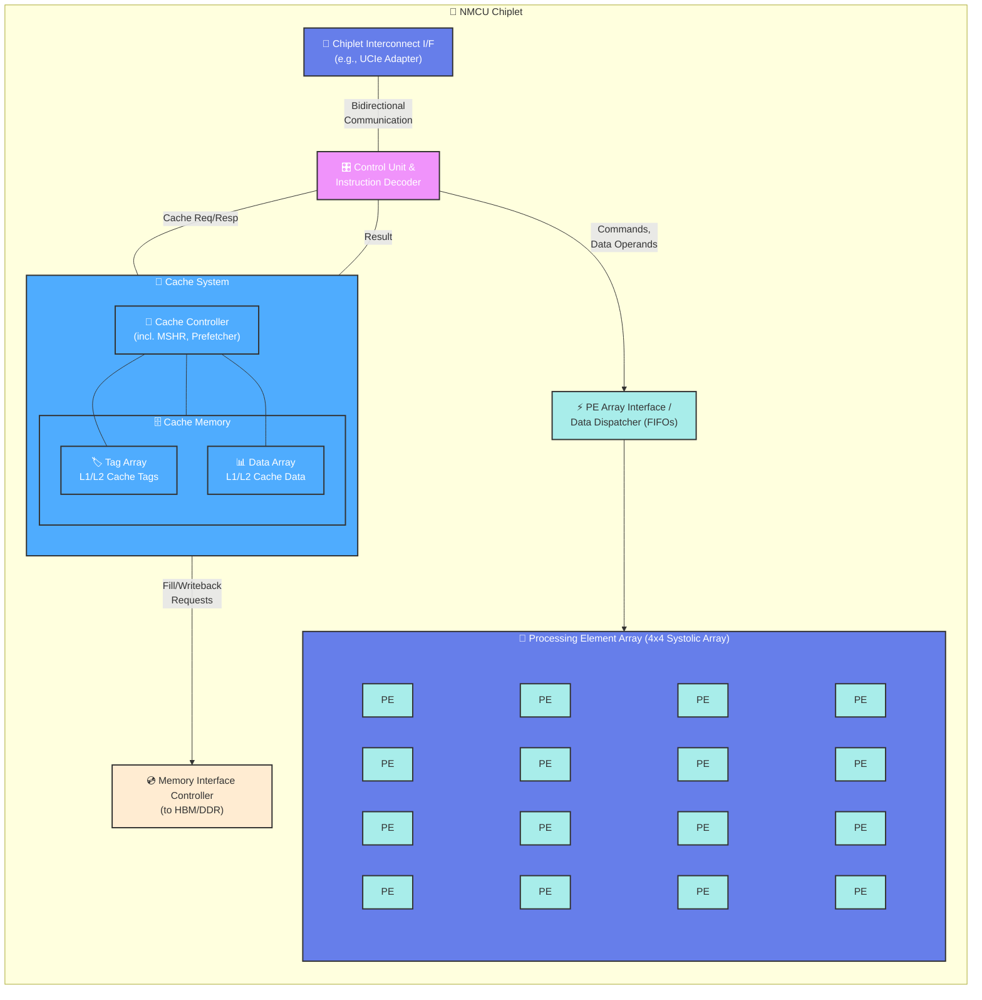

# NMCU_Chiplet

## General NMCU Architecture
```text
+---------------------------------------------------------------------------------+
|                                 NMCU Chiplet                                    |
|                                                                                 |
|  +---------------------------+      +--------------------------+                |
|  | Chiplet Interconnect I/F  |<---->|     Control Unit &       |                |
|  | (e.g., UCIe Adapter)      |      |     Instruction Decoder  |----(Commands,  |
|  +---------------------------+      +------------+-------------+     Data      |
|                                                  |   ^           Operands)   |
|                               (Cache Req/Resp)   |   | (Result)              |
|                                                  v   |                       v
|  +---------------------------------------------------+--------------+  +----------+------------------+
|  |                         Cache System                          |  | PE Array Interface/          |
|  | +----------------------+  +---------------------------------+ |  | Data Dispatcher (FIFOs)      |
|  | | Cache Controller     |  |          Cache Memory           | |  +--------------------------+
|  | | (incl. MSHR,         |<->| +-----------+   +-----------+   | |              |
|  | |  Prefetcher)         |  | | Tag Array |   | Data Array|   | |              v
|  | +--------+-------------+  | +-----------+   +-----------+   | |  +---------------------------+
|  |          |               +---------------------------------+ |  |  Processing Element Array |
|  +----------|---------------------------------------------------+  |  (e.g., Systolic Array)   |
|             | (Fill/Writeback Requests)                            |  +----+----+----+----+    |
|             v                                                      |  | PE | PE | PE | PE |    |
|   +------------------------+                                       |  +----+----+----+----+    |
|   |  Memory Interface      |                                       |  ...                      |
|   |  Controller (to HBM/   |                                       |  ...                      |
|   |  DDR)                  |                                       +---------------------------+
|   +------------------------+                                                    
|                                                                                 
+---------------------------------------------------------------------------------+
```




## Project Tree
```text
nmcu_project/
├── src/
│   ├── include/
│   │   ├── nmcu_pkg.sv                # Global parameters and common types
│   │   └── instr_pkg.sv               # Instruction opcodes and formats
│   ├── chiplets/
│   │   └── nmcu.sv                    # Top-level NMCU module
│   ├── interconnect/
│   │   └── chiplet_interconnect_if.sv # Placeholder for chiplet interconnect interface (simple AXI-like)
│   ├── control/
│   │   └── control_unit_decoder.sv    # Control Unit & Instruction Decoder
│   ├── cache/
│   │   └── cache_system.sv            # Simplified Cache System (bypass logic for now)
│   ├── pe/
│   │   ├── pe_array_interface.sv      # PE Array Interface & Data Dispatcher (modified as requested)
│   │   └── pe_array.sv                # Processing Element Array (simple MAC unit)
│   └── mem_ctrl/
│       └── memory_interface.sv        # Interface to external memory (HBM/DDR)
└── tb/
    └── nmcu_tb.sv                     # Testbench for NMCU module
```

## Features
- [x] Implement Basic structure of NMCU
- [ ] Implement systolic array with 4x4 PE array
    - [ ] change PE size to user-defined
- [ ] Implement complete cache module design
- [ ] Support complete memory interface
- [ ] Integrate ddr4 memory module.
- [ ] Implement Chiplet interconnection
- [ ] Enhance *fan-out* systolic arrays functionality. 
    - [ ] Weight Stationary
    - [ ] Input Stationary
    - [ ] Output Stationary
    - [ ] Row Stationary
- [ ] Experiment&Evaluation
    - [ ] Hardware Design Space Exploration
    - [ ] Transformers Benchmarking