# NMCU_Chiplet

## General NMCU Architecture
```text
+---------------------------------------------------------------------------------+
|                                 NMCU Chiplet                                    |
|                                                                                 |
|  +---------------------------+      +--------------------------+                |
|  | Chiplet Interconnect I/F  |<---->|     Control Unit &       |                |
|  | (e.g., UCIe Adapter)      |      |     Instruction Decoder  |----(Commands,  |
|  +---------------------------+      +------------+-------------+     Data      |
|                                                  |   ^           Operands)   |
|                               (Cache Req/Resp)   |   | (Result)              |
|                                                  v   |                       v
|  +---------------------------------------------------+--------------+  +----------+------------------+
|  |                         Cache System                          |  | PE Array Interface/          |
|  | +----------------------+  +---------------------------------+ |  | Data Dispatcher (FIFOs)      |
|  | | Cache Controller     |  |          Cache Memory           | |  +--------------------------+
|  | | (incl. MSHR,         |<->| +-----------+   +-----------+   | |              |
|  | |  Prefetcher)         |  | | Tag Array |   | Data Array|   | |              v
|  | +--------+-------------+  | +-----------+   +-----------+   | |  +---------------------------+
|  |          |               +---------------------------------+ |  |  Processing Element Array |
|  +----------|---------------------------------------------------+  |  (e.g., Systolic Array)   |
|             | (Fill/Writeback Requests)                            |  +----+----+----+----+    |
|             v                                                      |  | PE | PE | PE | PE |    |
|   +------------------------+                                       |  +----+----+----+----+    |
|   |  Memory Interface      |                                       |  ...                      |
|   |  Controller (to HBM/   |                                       |  ...                      |
|   |  DDR)                  |                                       +---------------------------+
|   +------------------------+                                                    
|                                                                                 
+---------------------------------------------------------------------------------+
```




```mermaid
graph TB
    subgraph CHIPLET ["🔲 NMCU Chiplet"]
        direction TB
        
        %% Top Level Components
        INTERCONNECT["📡 Chiplet Interconnect I/F<br/>(e.g., UCIe Adapter)"]
        CONTROL["🎛️ Control Unit &<br/>Instruction Decoder"]
        
        %% Cache System Subgraph
        subgraph CACHE_SYS ["💾 Cache System"]
            direction TB
            CACHE_CTRL["🔧 Cache Controller<br/>(incl. MSHR, Prefetcher)"]
            
            subgraph CACHE_MEM ["🗄️ Cache Memory"]
                direction TB
                TAG_ARRAY["🏷️ Tag Array<br/>L1/L2 Cache Tags"]
                DATA_ARRAY["📊 Data Array<br/>L1/L2 Cache Data"]
            end
        end
        
        %% Memory Interface
        MEM_CTRL["💿 Memory Interface Controller<br/>(to HBM/DDR)"]
        
        %% PE Array Components
        PE_INTERFACE["⚡ PE Array Interface /<br/>Data Dispatcher (FIFOs)"]
        
        subgraph PE_ARRAY ["🔢 Processing Element Array (4x4 Systolic Array)"]
            direction TB
            subgraph ROW1 [" "]
                direction LR
                PE_0_0["PE"] 
                PE_0_1["PE"] 
                PE_0_2["PE"] 
                PE_0_3["PE"]
            end
            subgraph ROW2 [" "]
                direction LR
                PE_1_0["PE"] 
                PE_1_1["PE"] 
                PE_1_2["PE"] 
                PE_1_3["PE"]
            end
            subgraph ROW3 [" "]
                direction LR
                PE_2_0["PE"] 
                PE_2_1["PE"] 
                PE_2_2["PE"] 
                PE_2_3["PE"]
            end
            subgraph ROW4 [" "]
                direction LR
                PE_3_0["PE"] 
                PE_3_1["PE"] 
                PE_3_2["PE"] 
                PE_3_3["PE"]
            end
        end
    end
    
    %% Main Data Flow Connections
    INTERCONNECT ---|"Bidirectional<br/>Communication"| CONTROL
    CONTROL -->|"Commands,<br/>Data Operands"| PE_INTERFACE
    
    %% Cache System Connections
    CONTROL ---|"Cache Req/Resp"| CACHE_SYS
    CACHE_CTRL --- CACHE_MEM
    CACHE_CTRL --- TAG_ARRAY
    CACHE_CTRL --- DATA_ARRAY
    CACHE_SYS ---|"Result"| CONTROL
    
    %% Memory Interface Connection
    CACHE_SYS -->|"Fill/Writeback<br/>Requests"| MEM_CTRL
    
    %% PE Array Connection
    PE_INTERFACE --> PE_ARRAY
    
    %% Styling
    classDef interconnectStyle fill:#667eea,stroke:#333,stroke-width:2px,color:#fff
    classDef controlStyle fill:#f093fb,stroke:#333,stroke-width:2px,color:#fff
    classDef cacheStyle fill:#4facfe,stroke:#333,stroke-width:2px,color:#fff
    classDef memoryStyle fill:#ffecd2,stroke:#333,stroke-width:2px,color:#333
    classDef peStyle fill:#a8edea,stroke:#333,stroke-width:2px,color:#333
    classDef arrayStyle fill:#667eea,stroke:#333,stroke-width:2px,color:#fff
    classDef rowStyle fill:none,stroke:none
    
    class INTERCONNECT interconnectStyle
    class CONTROL controlStyle
    class CACHE_SYS,CACHE_CTRL,CACHE_MEM,TAG_ARRAY,DATA_ARRAY cacheStyle
    class MEM_CTRL memoryStyle
    class PE_INTERFACE peStyle
    class PE_ARRAY arrayStyle
    class PE_0_0,PE_0_1,PE_0_2,PE_0_3,PE_1_0,PE_1_1,PE_1_2,PE_1_3,PE_2_0,PE_2_1,PE_2_2,PE_2_3,PE_3_0,PE_3_1,PE_3_2,PE_3_3 peStyle
    class ROW1,ROW2,ROW3,ROW4 rowStyle
```

## Project Tree
```text
nmcu_project/
├── src/
│   ├── include/
│   │   ├── nmcu_pkg.sv                # Global parameters and common types
│   │   └── instr_pkg.sv               # Instruction opcodes and formats
│   ├── chiplets/
│   │   └── nmcu.sv                    # Top-level NMCU module
│   ├── interconnect/
│   │   └── chiplet_interconnect_if.sv # Placeholder for chiplet interconnect interface (simple AXI-like)
│   ├── control/
│   │   └── control_unit_decoder.sv    # Control Unit & Instruction Decoder
│   ├── cache/
│   │   └── cache_system.sv            # Simplified Cache System (bypass logic for now)
│   ├── pe/
│   │   ├── pe_array_interface.sv      # PE Array Interface & Data Dispatcher (modified as requested)
│   │   └── pe_array.sv                # Processing Element Array (simple MAC unit)
│   └── mem_ctrl/
│       └── memory_interface.sv        # Interface to external memory (HBM/DDR)
└── tb/
    └── nmcu_tb.sv                     # Testbench for NMCU module
```

## Features
- [x] Implement Basic structure of NMCU
- [ ] Implement systolic array with 4x4 PE array
    - [ ] change PE size to user-defined
- [ ] Implement complete cache module design
- [ ] Support complete memory interface
- [ ] Integrate ddr4 memory module.
- [ ] Implement Chiplet interconnection
- [ ] Enhance *fan-out* systolic arrays functionality. 
    - [ ] Weight Stationary
    - [ ] Input Stationary
    - [ ] Output Stationary
    - [ ] Row Stationary
- [ ] Experiment&Evaluation
    - [ ] Hardware Design Space Exploration
    - [ ] Transformers Benchmarking